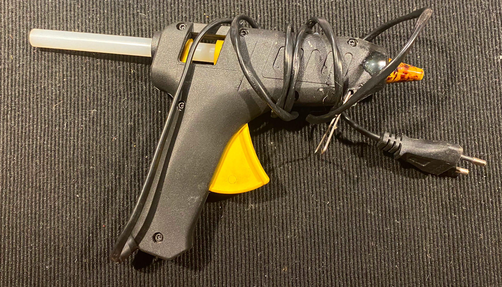
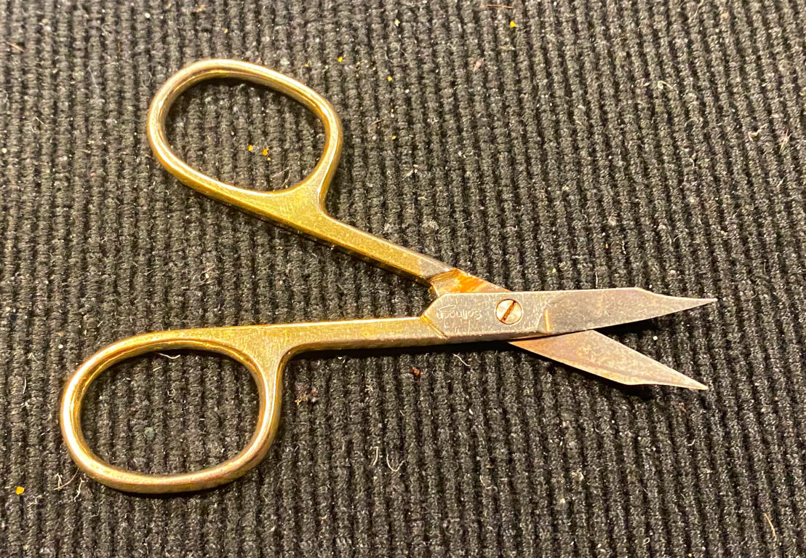

# Tools required for this project...

## Soldering Station

With a tiny round tip...

## Cutter Knife

Get a decent one...

## English Tool

From Grandpa, good to hold things in place...

## Flat nose pliers

Heavily used...

## Hot glue gun

Cannot be without it...

## Multimeter

Identifies problems...

## Nail scissors

Taken from my girlfriend...

## Side cutters

Another one from Grandpa...

## Small Phillips Screwdriver

Found in a disk housing set...

## Soldering Extractor

Useful if You really fucked it up...

## Soldering Iron

From Grandpa, needed to melt down copper wire isolation...

## Tiny Screwdriver

Also fixes up girlfriend sunglasses...

## Tweezers

Taken from girlfriend...

