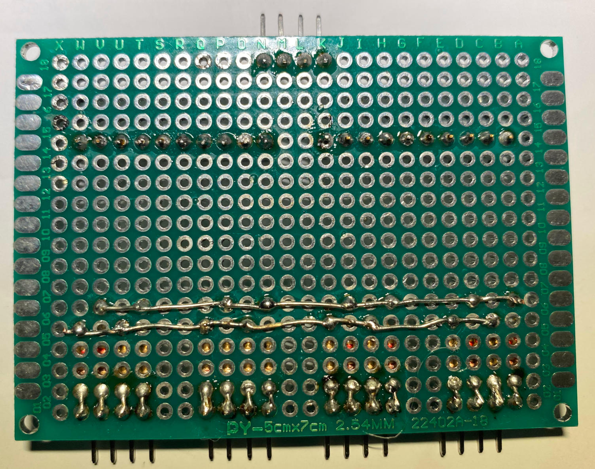

# Analog-Digital Converters for Carrera-Go Speed Controllers

Converts the resistor values from the original **Carrera-Go Speed 
Controllers** into digital values for further processing.

The conversion is done via dual **ADS1115** analog/digital with 4
analog inputs each yielding in 8 tracks.

The data is exchanged via the **I2C** bus with the **Raspberry Pi**.

## Benefits

- Enables **full throttle speed** with **Carrera-Go** Controllers w/o hardware modification
- Can be used with or without **Carrera-Go** turbo-switch.
- **Very fine** speed control also at **lower speeds**.
- Pilots can configure **individual response curves**.
- Pilots can configure **minimum low and top speed** individually.
- Controls up to **6 pilots/tracks** plus 2 spare inputs.

Material List
=============

  2 x I2C ADS1115 16Bit ADC 4 Channel Module Gain Amplifier (https://www.amazon.de/dp/B07RJT3GHC)

  1 x Development Board 24 x 18 holes (https://www.amazon.de/dp/B0734XYJPM)

16 x 1k Ohm resistor (https://www.amazon.de/dp/B0BMXBZCTF) 

  1 x 2.54mm Breakaway 40 Pin Right Angle Single Row Pin Header PCB Connector (https://www.amazon.de/dp/B01MZE0XGZ)

  1 x 2.54mm Breakaway 40 Pin Female Header PCB Connector (https://www.amazon.de/dp/B07DBY753C)

  1 x Distance Holder Set (https://www.amazon.de/dp/B08VD1ZCFJ)

  1 x Enameled Copper Wire 0.4 mm (https://www.amazon.de/dp/B0DCJQJJCY)

Tool Set
========

[Look here...](../a2z-tools/readme.md)

Step 1
======

Mount the 1k Ohm voltage divider resistors. Pull them tight
with a plunge so that they line up nicely on the front side.

**Do no soldering yet!**

Step 2
======

Now solder the spots at the bottom of the picture. 

After soldering use a nail scissor to cut the remainder of the resistor's wire. 

Bent and cut it that way, so it just connects to the next contact hole. This is required later on.

Now we want to accomplish a connections between all ends of the lower resistor array.

Bent and cut the wire a shown in the picture and solder the spots.

Now we want to accomplish a connections between all ends of the upper resistor array the same way.

**Tip: The resistor wires are sometimes reluctant to soldering.**

**Use a multi-meter to make sure they are all connected.**

**This will save You from debugging later on.**

Step 3
======

Mount the analog input right angle connectors.

Connect and solder the ends of the resistors together with the connector pins.

**Tip: Again, the resistor wires are sometimes reluctant to soldering.**

**Use a multi-meter to make sure they are all connected.**

**This will save You from debugging later on.**

Step 4
======

Mount the I2C input connector and the ADS1115 inline sockets.

Solder only one pin of the inline sockets first, then make sure before soldering the rest,
they are standing nicely upright.

Step 5
======

Solder pins into ADS1115. Make sure, You solder them as the picture shows!

Step 6
======

Now we start with the wired connections. 

If You never used enameled copper wire please notice:

- The wire is isolated with enamel.
- The melting/burning point of the isolation is relatively high.
- Prepare the wire before applying them to the board.
- Use a very hot soldering iron to "burn" the ends You want to solder later on.

You can see in this image how the connecting ends are covered with tin and ready to apply.

We apply all 5V connections. Consult the wiring diagram at end of this if unclear.

Please notice that one connect goes to the ADDR pin of ADS1115 #2. 
This will result in an I2C chip address of 0x49.

We apply all GND connections. Consult the wiring diagram at end of this if unclear.

Please notice that one connect goes to the ADDR pin of ADS1115 #1.
This will result in an I2C chip address of 0x48.

Step 7
======

Again prepare two more wire likes this.

Solder the SCL and SDA pins of ADS1115 #1 and #2 like this.

Step 8
======

Again prepare the eight wires for the control analog inputs.

Solder them to the input pins of the two ADS1115 first like this.

Solder them to the pin connectors like this now.

**Tip: After this step, and if You have a multi-meter, perform 
some checkups to save You from trouble:**

- Check if there is NO shortcut between 5V and GND. Important!
- Check ADS1115 address pins connected to 5V (#2) and GND (#1).
- Check if SDA and SCL is connected from the ADS1115s to the connector.
- Feel free to check all other connections.

Step 9
======

Now we apply the supports for the ADS1115 modules.

I have to confess, that we should have drilled the holes in an earlier step.

I forgot about them. That's life.

We will use two distance holders for each support to yield the right height.

Connect them like this:

Drill 2 mm holes in the board. See the red markers where they should be.

If Your wiring should be in the way, move it softly away.

Apply the two combined supports in the holes. Do not tighten the nuts too hard,
because the positions do not fit exactly.

That is the way it should look like...

Step 10
=======

Now we mount the two ADS1115s. Apply the screws and tighten bot nuts and screws softly. Softly!

The result should look like this.

Step 11
=======

The final step. Mount the board distance holders.

The result should look like this.

... and like this.

God job!
