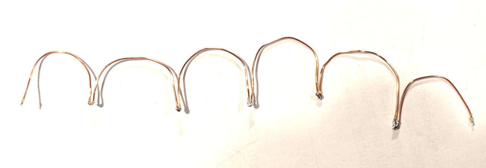

# Dual I2C Bus

The **I2C bus** is required to connect the things and sensors
to our **Raspberry**.

## Benefits

- Two independent I2C buses
- Avoids performance problems
- Avoids Í2C address conflicts 

Material List
=============

1 x Development Board 24 x 18 holes (https://www.amazon.de/dp/B0734XYJPM)

2 x 2.54mm Breakaway 40 Pin Right Angle Single Row Pin Header PCB Connector (https://www.amazon.de/dp/B01MZE0XGZ)

1 x Distance Holder Set (https://www.amazon.de/dp/B08VD1ZCFJ)

1 x Enameled Copper Wire 0.4 mm (https://www.amazon.de/dp/B0DCJQJJCY)

Tool Set
========

[Look here...](../a2z-tools/readme.md)

Step 1
======

Break out 14 x 4 pins.

Place the pins on board following this scheme.

Backside after soldering.

Step 2
======

Prepare a wire.

Tip: Use Your thumb to measure out the size of the bows.

Pre-solder the connection points.

Solder this wire following this scheme:

Step 3
======

If the first wire was a good fit, prepare seven more wires.

Solder the first I2C bus like this.

Solder the second I2C bus like this.

Step 4
======

Attach distance holders.

View from back side.

View from front side.

Good job!
