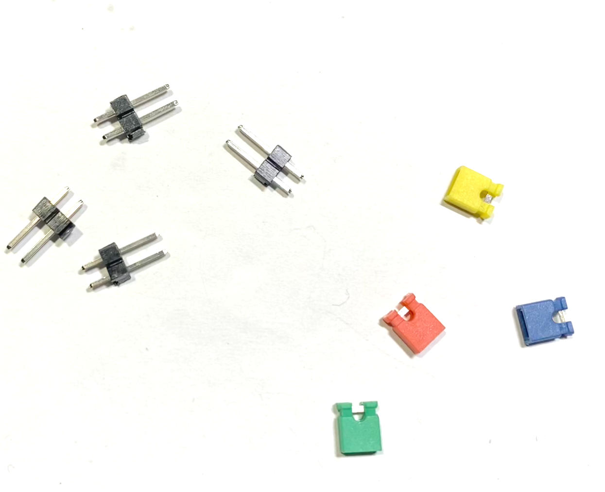

# Motoron-Unit for Carrera-Go motor control

Converts speed control instructions into track voltage.

The conversion is done via Pololu M2T550 Motorons each of which 
can control the car voltage for two tracks.

The data is exchanged via the **I2C** bus with the **Raspberry Pi**.

## Benefits

- 0 - 100 % voltage regulation.
- Pilot individual power curves.
- Min and max speed limiting.
- Input voltage from 10 V upto 20 V.

Material List
=============

1-4 x Pololu Motoron M2T550 Dual I2C Motor Controller (https://www.amazon.de/dp/B0DJBYSWN5)

1 x Development Board 24 x 18 holes (https://www.amazon.de/dp/B0734XYJPM)

1 x 2.54mm Breakaway 40 Pin Right Angle Single Row Pin Header PCB Connector (https://www.amazon.de/dp/B01MZE0XGZ)

1 x 2.54mm Breakaway 40 Pin Female Header PCB Connector (https://www.amazon.de/dp/B07DBY753C)

1 x 2.54mm Breakaway 40 Pin Connectors (https://www.amazon.de/dp/B0DJ2MYFMB)

4 x Jumper 2.54 mm (https://www.amazon.de/dp/B0CSJDDXML)

1 x Steckersortiment (https://www.amazon.de/dp/B0D7HXG492)

1 x Distance Holder Set (https://www.amazon.de/dp/B08VD1ZCFJ)

1 x Enameled Copper Wire 0.4 mm (https://www.amazon.de/dp/B0DCJQJJCY)

Tool Set
========

[Look here...](../a2z-tools/readme.md)

Step 1
======

Prepare 5 x 4 pin right angel row connectors.

Get Your development 24 x 18 holes board.

Solder the connectors like displayed here:

View from soldering side.

Step 2
======

Prepare 4 x 8 pin, 4 x 6 pin and 4 x 1 pin female headers.

Solder the headers like displayed here:

View from soldering side.

Step 3
======

Prepare 4 x 2 pin straight connectors with jumpers.

Solder the jumpers like displayed here:

Step 4
======

Get two driving power connectors.

Cut the middle pin like this:

Solder them into these positions:

**Remark: The connectors do not exactly fit the raster.**

Step 5
======

Prepare the single power source jumper.

Solder it into this position:

