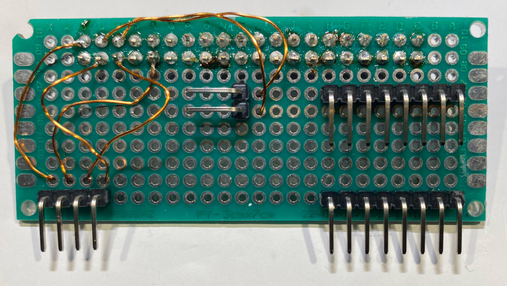
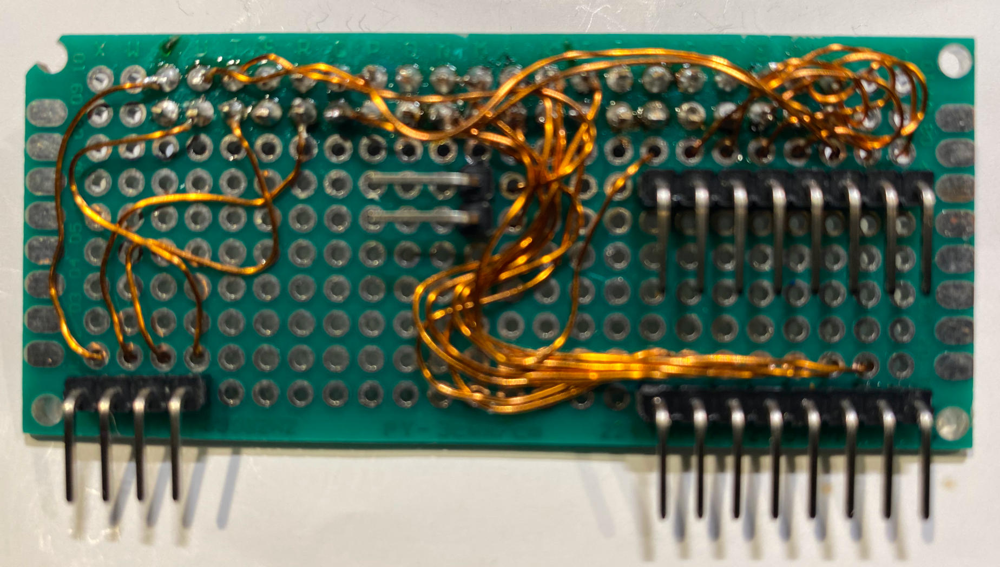
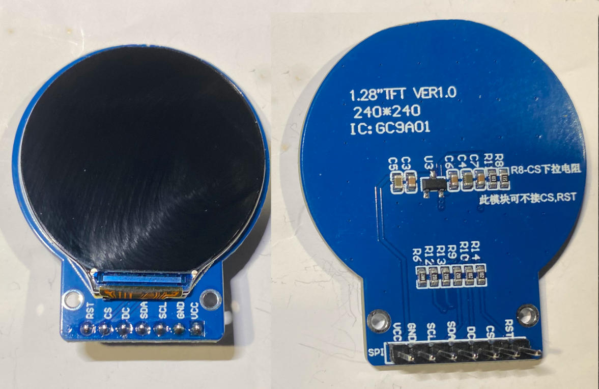

# Raspberry Pi Hat with I2C and SPI interfaces.

bla bla 

## Benefits

- Hassle-free breakout - no modification of Raspberry Pi required.
- 4 pin breakout I2C-1 bus connector with 5V power supply.
- 8 pin breakout SPI-0 connector with 3.3V power supply and 2 chip selects.
- 8 pin breakout SPI-1 connector with 3.3V power supply and 3 chip selects.

Material List
=============

1 x Development Board 24 x 10 holes (https://www.amazon.de/dp/B0734XYJPM)

2 x Female Header 2x20 pins 2.54 mm Pitch extra high (https://www.amazon.de/dp/B07YDKX8SR)

1 x 2.54mm Breakaway 40 Pin Right Angle Single Row Pin Header PCB Connector (https://www.amazon.de/dp/B01MZE0XGZ)

1 x Enameled Copper Wire 0.4 mm (https://www.amazon.de/dp/B0DCJQJJCY)

Tool Set
========

[Look here...](../a2z-tools/readme.md)

Step 1
======

Mount the female header and solder it.

This will be the position.

After soldering.

Cut the pins down to the soldering with a nail-scissor.

Step 2
======

Now we mount the right angle single pin headers for I2C-1, SPI-0, SPI-1 and
an additional two pin 5V and GND connector for Raspberry Pi's fan if desired.

This will be the positions.

**Important: it is correct that these pins go to soldering side of board.**

**Tip: Solder a single pin of each connector first and then make
sure they are standing straight.**

Step 3
======

Now we start with the additional 5V pin header because it is simple.

Prepare Your connecting wires.

Solder each wire on the connectors pin and thread through the holes as displayed.

Pull the wires tight with a tweezer or plunge.

Unconnected wire after pulling them tight.

Solder them to 5V pin and GND pin as displayed in the image.

Step 4
======

We continue with the 4 pin I2C connector.

Prepare Your connecting wires.

Pull the wires tight with a tweezer or plunge.

Unconnected wires after pulling them tight.

Solder them as displayed in the image.

The I2C connector pins from left to right:

- 5V
- GND
- SCL (GPIO 3 Serial Clock I2C)
- SDA (GPIO 2 Serial Data I2C)

Step 5
======

We continue with the 8 pin SPI-0 connector.

Prepare Your 7 connecting wires, 5 short wires and 3 longer wires.

Unconnected wires after pulling them tight.

Unconnected wires before soldering.

Connected wires after soldering.

The SPI-0 connector pins from left to right:

- 3.3V
- GND
- SCLK (GPIO 11 SCLK SPI 0)
- MISO (GPIO 9 MISO SPI 0)
- MOSI (GPIO 10 MOSI SPI 0)
- CE0 (GPIO 8 Chip Enabled-CE0 SPI 0)
- CE1 (GPIO 7 Chip Enabled-CE1 SPI 0)

Step 6
======

We continue with the 8 pin SPI-1 connector.

Prepare now 8 connecting wires with different lengths. 

The SPI-1 connector pins from left to right:

- 3.3V
- GND
- SCLK (GPIO 21 SCLK SPI 1)
- MISO (GPIO 19 MISO SPI 1)
- MOSI (GPIO 20 MOSI SPI 1)
- CE0 (GPIO 18 Chip Enabled-CE0 SPI 1)
- CE1 (GPIO 17 Chip Enabled-CE1 SPI 1)
- CE2 (GPIO 16 Chip Enabled-CE2 SPI 1)

Unconnected wires of backside.

Unconnected wires of topside.

Connected wires after soldering.

Step 7
======

Mounting the hat to the Raspberry Pi.

This is my old and rugged Raspberry Pi 3B in a GeekPi housing.

As You can see, the hat needs an extension to connect.

Hat mounted with extension.

Hat mounted to Pi and fan power attached.

Step 8
======

Testing the I2C-1 breakout.

I will use a ADS1115 chip which will show up at address 0x48 in the I2C scan.

4 line connecting cable.

4 line connecting cable with ADS1115 attached.

**Double-check the polarity!**

Device attached to I2C-1 breakout.

**Double-check the polarity!**

Output of the i2cdetect tool on Raspberry Pi terminal.

Good job!!!

Step 9
======

Addendum:

We want to use the SPI-0 breakout for a nice display
device GC9A01. (https://www.amazon.de/dp/B0CFXVD9HX)

These devices need another control pin named DC. 
So we need to add another wire to the board.

The wire goes to the unconnected last pin of the SPI-0 connector.

The extra wire is now attached to GPIO pin 25.

The SPI-0 connector pins from left to right:

- 3.3V
- GND
- SCLK (GPIO 11 SCLK SPI 0)
- MISO (GPIO 9 MISO SPI 0)
- MOSI (GPIO 10 MOSI SPI 0)
- CE0 (GPIO 8 Chip Enabled-CE0 SPI 0)
- CE1 (GPIO 7 Chip Enabled-CE1 SPI 0)
- DC (GPIO 25 )

