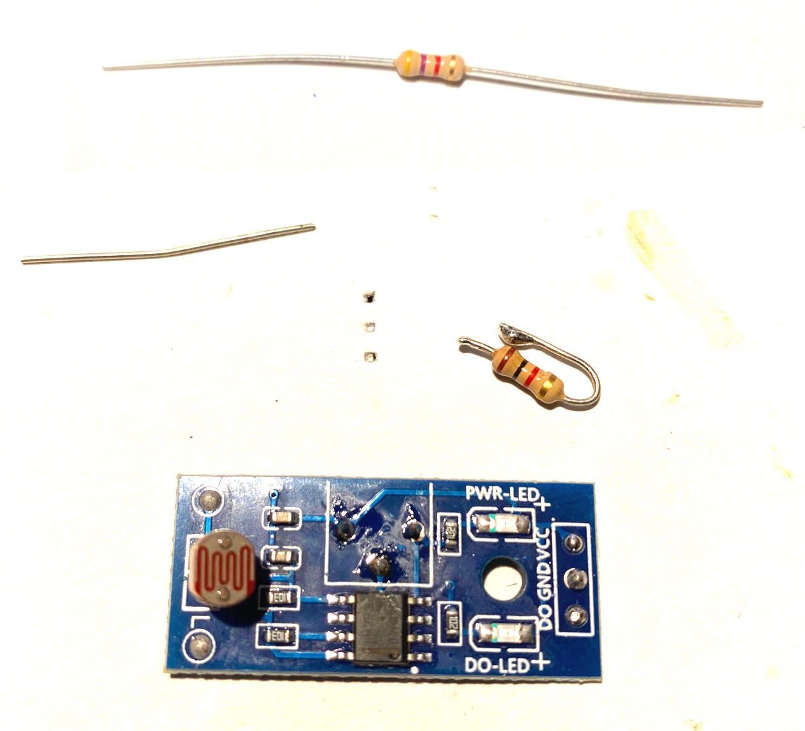

# Tacho-Sensors for Carrera-Go Speed and Round measurement

Build into a standard straight Carrera-Go track with four
sensor per track with two lanes.

## Benefits

- True speed measurement.
- Lap counting.
- Early take off recognition.

Material List
=============

1 x 2.54mm Breakaway 40 Pin Female Header PCB Connector (https://www.amazon.de/dp/B07DBY753C)

1 x Enameled Copper Wire 0.4 mm (https://www.amazon.de/dp/B0DCJQJJCY)

Tool Set
========

[Look here...](../a2z-tools/readme.md)

Step 1
======

Prepare the light sensors.

We need to flatten the light sensors so they fit under the  Carrera-Go track.

**Info: You have to repeat these steps for each of
the four sensors we need for a track.**

Use a cutter-knife to separate the three connector pins for
easier de-soldering.

De-solder each of the three pins.

View after de-soldering.

Backside view after de-soldering.

Apply some new tin on the contacts for later.

Step 2
======

Remove the variable trimming resistor. It will be replaced
by fixed resistors which have the right threshold for our purpose.

Break out the resistor with a little bit of brute force.

Remove any debris from the removed resistor.

Apply some extra tin to the leftovers of the resistor pins.

Sorry for the unsharp image...

Step 3
======

Apply the fixed resistors to sensor.

You will need one 1K and one 4K7 Ohm resistor. Do not mix them up.

Resistors:
- 1K Ohm is brown, black, red and gold
- 4k7 Ohm is yellow, violet, red and gold

Start with the 1K Ohm resistor. Bend and cut it like seen on the image.

**Pre-tin the endings.**

**Notice: Keep the longer cut of piece of wire.**

Solder it like shown in the image.

**Do NOT cover the LEDs with the resistor!**

Continue with the 4k7 Ohm resistor. Bend and cut it like seen on the image.

**Pre-tin the endings.**

**Notice: Keep the longer cut of piece of wire.**

Solder it like shown in the image.

Step 4
======

This step needs to be done with all sensor modules.

De-solder the photo resistor.

Step 5
======

This step needs to be done with two sensors.

Re-solder it to one of the outer contacts.

Solder one of the spare wires to the opposite contact like shown here.

Bend it towards the dangling leg of the photo resistor and solder it there.

Cut off all superfluous ends of wires and legs.

View of the result from top.

Step 6
======

This step needs to be done with two sensors.

Re-solder it to the opposite outer contacts.

Solder one of the spare wires to the opposite contact like shown here.

Bend it towards the dangling leg of the photo resistor and solder it there.

Cut off all superfluous ends of wires and legs.

Your should now have two left side and two right side sensors.

Step 7
======

Prepare the Carrera-Go track.

Drill the red holes just in the corner of that track area with a 5.5 mm drill.

Drill the green holes so they enable the LEDs of the sensors to 
shine through the track with  a 2.5 mm drill.

