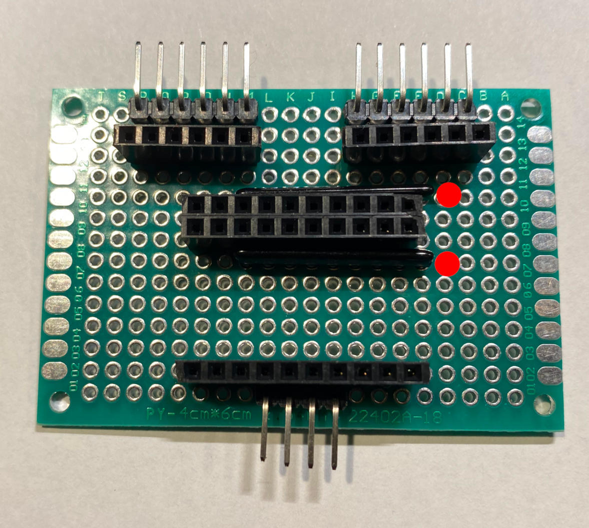

# Tacho-Unit for Carrera-Go Speed and Round measurement

Converts the resistor values from the original **Carrera-Go Speed
Controllers** into digital values for further processing.

The conversion is done via dual **ADS1115** analog/digital with 4
analog inputs each yielding in 8 tracks.

The data is exchanged via the **I2C** bus with the **Raspberry Pi**.

## Benefits

- True speed measurement.
- Lap counting.
- Early take off recognition.

Material List
=============

1 x I2C MCP23017 16-Bit I/O Expander with Serial Interface (https://www.amazon.de/dp/B0DGKKR9BV)

2 x Development Board 20 x 14 holes (https://www.amazon.de/dp/B0734XYJPM)

2 x SIL Resistor Array 8 x 10-20K (https://www.amazon.de/dp/B07DK2T7MY)

1 x 2.54mm Breakaway 40 Pin Right Angle Single Row Pin Header PCB Connector (https://www.amazon.de/dp/B01MZE0XGZ)

1 x 2.54mm Breakaway 40 Pin Female Header PCB Connector (https://www.amazon.de/dp/B07DBY753C)

1 x Distance Holder Set (https://www.amazon.de/dp/B08VD1ZCFJ)

1 x Enameled Copper Wire 0.4 mm (https://www.amazon.de/dp/B0DCJQJJCY)

Tool Set
========

[Look here...](../a2z-tools/readme.md)

Step 1
======

Prepare 2 x 6 pin right angel row, 1 x 4 pin right angel row,
2 x 6 pin female headers and 3 x 10 pin female headers.

Pick any two inline resistor arrays from 10k - 20k Ohm.
The red dot denotes the array input pin.

Get a 20 x 14 development board...

Place the items on the board. The red dot denotes the array input pin.

Backside with soldering. The red dot denotes the array input pin.

**Tip: Bend the resistor array pins against the other pins. 
They need to be connected via a soldering spot. 
See enlarged image how to.**

Solder now the array pins against the header pins.

Step 2
======

Prepare the MCP23017 16-Bit I/O Expander. Solder the
pin rows like in this image.

**Important: Solder the pin rows from the correct side!**

Solder from the side where the pin description is printed like
in this image.

Step 3
======

Prepare the 8 track expander. 

**Tip: Even if You do not intend to have 8 tracks, do it now.
Otherwise, You will probably do it never. There is not too
much costs involved.**

Get the second 20 x 14 developer board.

Saw the board in half as shown.

Prepare 2 x 6 pin right angle connectors.

Apply to board like shown.

Now solder a row of "blind" holes to the connector.

View from front-side after soldering.

Prepare 2 x 6 pin straight connectors.

Apply connectors from opposite side.

Solder the connectors and connect each pin to the soldered "blind" hole.

Step 4
======

Apply distance holders to board.

Make two long holders from the holders with thread.

Back-side view.

Now we attach the 8 track expander board.

It You made it right the straight 6 row pins fit into to 6 row female connectors.

Complete assembly with MCP23017 also attached.

Step 5
======

5V and GND connections.

Prepare the 5V connection wire.

Solder the 5V connection wire like this.

Prepare the GND connection wire.

Solder the GND connection wire like this. 
GND is also connected to the pull down resistor array inputs.

Step 6
======

Connect SDA adn SCL pins.

Prepare a single wire.

The SDA connectors are adjacent. So we simply do a soldering bridge. 
Sorry for the unsharp picture. See next image also for a better view.

Solder the SLC wire.

Step 7
======

Connect the 16 GPIO pins.

Prepare 16 wires.

We have a total of 16 GPIO pins. A set of 4 GPIO pins makes up
a group. So we have a total of 4 groups:

- A0-3 resp. A3-0
- A4-7 resp. A7-4
- B0-3 resp. B3-0
- B4-7 resp. B7-4

Solder one end of all 16 wires like this.

Solder the remaining ends.

**Tip: Solder the groups in this order:**

- B0-3 resp. B3-0
- B4-7 resp. B7-4
- A0-3 resp. A3-0
- A4-7 resp. A7-4

**Important: Notice that the groups endpoint have a reversed order!**

**Tip: Before connection it to the I2C bus check if there are no shortcuts between 5V and GND.**

**Good Job!**
